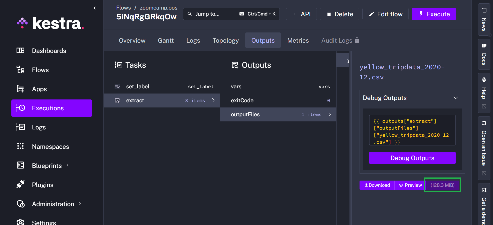

# Module 2 Homework: Orchestration with Kestra

## Question 1: Within the execution for `Yellow` Taxi data for the year `2020` and month `12`: what is the uncompressed file size (i.e. the output file `yellow_tripdata_2020-12.csv` of the `extract` task)?
- **128.3 MB**
- 134.5 MB
- 364.7 MB
- 692.6 MB



## Question 2: What is the rendered value of the variable `file` when the inputs `taxi` is set to `green`, `year` is set to `2020`, and `month` is set to `04` during execution?
- `{{inputs.taxi}}_tripdata_{{inputs.year}}-{{inputs.month}}.csv` 
- **`green_tripdata_2020-04.csv`**
- `green_tripdata_04_2020.csv`
- `green_tripdata_2020.csv`

The rendered value is `green_tripdata_2020-04.csv`

## Question 3: How many rows are there for the `Yellow` Taxi data for all CSV files in the year 2020?
- 13,537.299
- **24,648,499**
- 18,324,219
- 29,430,127

SQL query used to answer this question:

```sql
select count(unique_row_id)
from public.yellow_tripdata
where filename like 'yellow_tripdata_2020%';
```

## Question 4: How many rows are there for the `Green` Taxi data for all CSV files in the year 2020?
- 5,327,301
- 936,199
- **1,734,051**
- 1,342,034

SQL query used to answer this question:

```sql
select count(unique_row_id)
from public.green_tripdata
where filename like 'green_tripdata_2020%';
```


## Question 5: How many rows are there for the `Yellow` Taxi data for the March 2021 CSV file?
- 1,428,092
- 706,911
- 1,925,152
- 2,561,031

SQL query used to answer this question:

```sql
select count(unique_row_id)
from public.yellow_tripdata
where filename = 'yellow_tripdata_2021-03.csv';
```

## Question 6: How would you configure the timezone to New York in a Schedule trigger?
- Add a `timezone` property set to `EST` in the `Schedule` trigger configuration  
- **Add a `timezone` property set to `America/New_York` in the `Schedule` trigger configuration**
- Add a `timezone` property set to `UTC-5` in the `Schedule` trigger configuration
- Add a `location` property set to `New_York` in the `Schedule` trigger configuration  

According to [Kestra documentation](https://kestra.io/plugins/core/triggers/io.kestra.plugin.core.trigger.schedule), we should use the Time Zone Identifier format, which in this case is `America/New_York`.

Example below:

```yaml
triggers:
  - id: green_schedule
    type: io.kestra.plugin.core.trigger.Schedule
    timezone: America/New_York
```